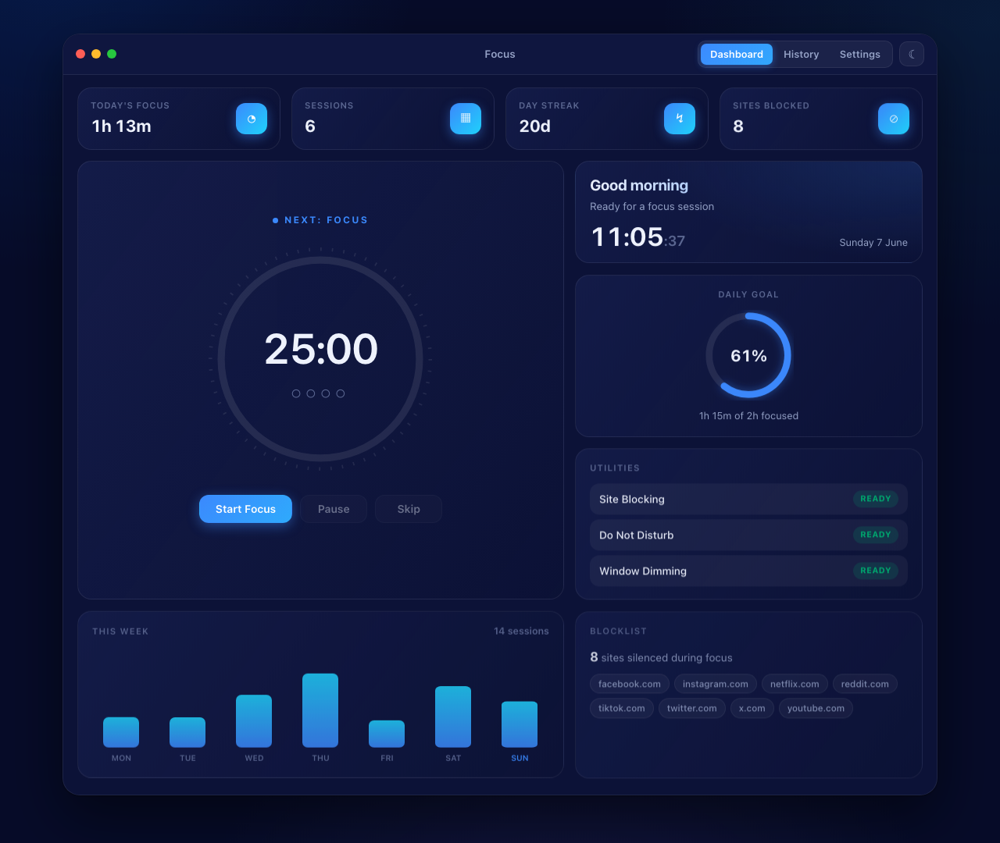
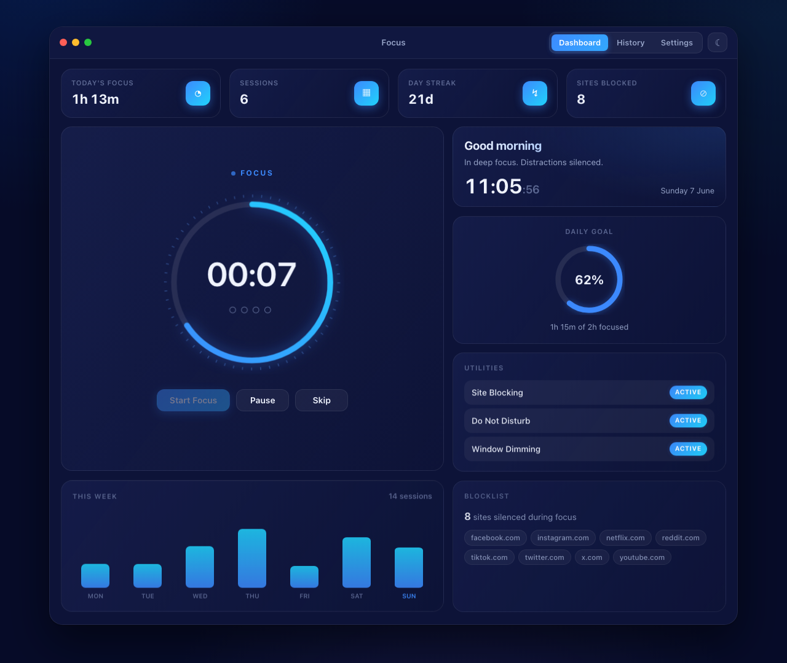
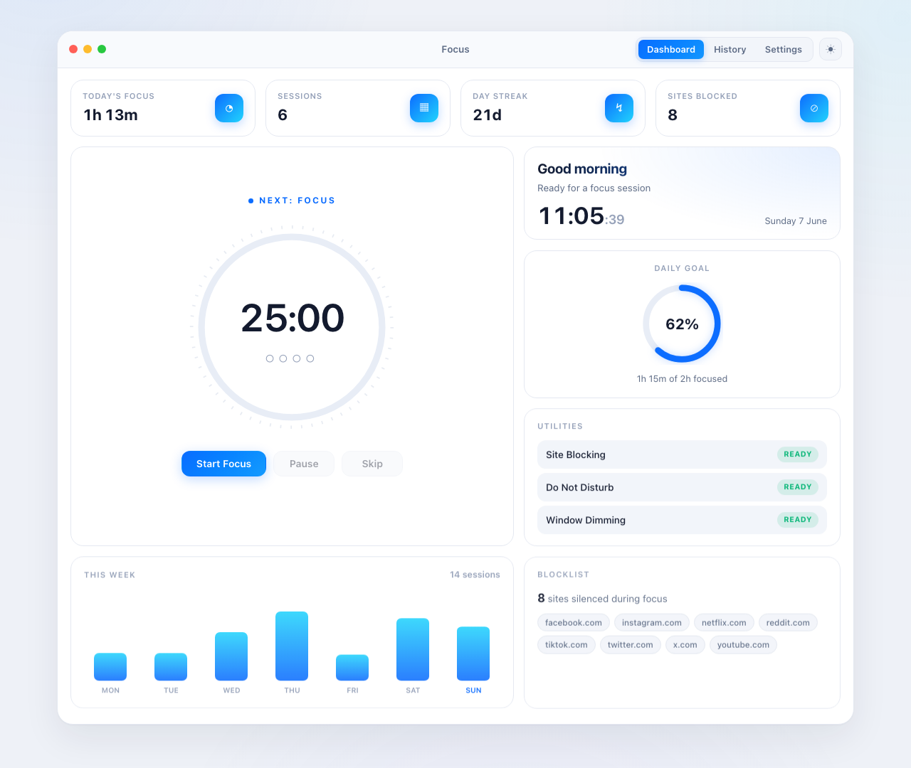
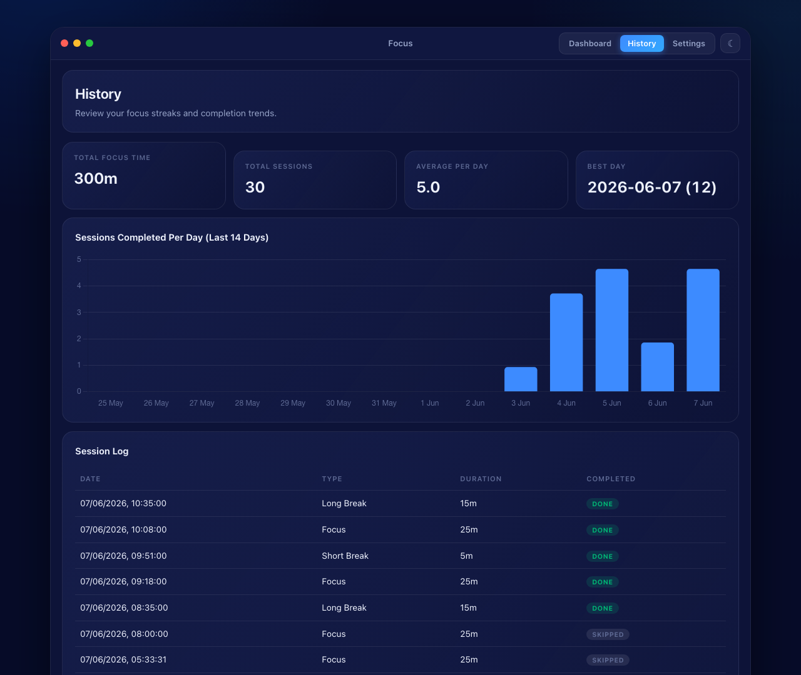
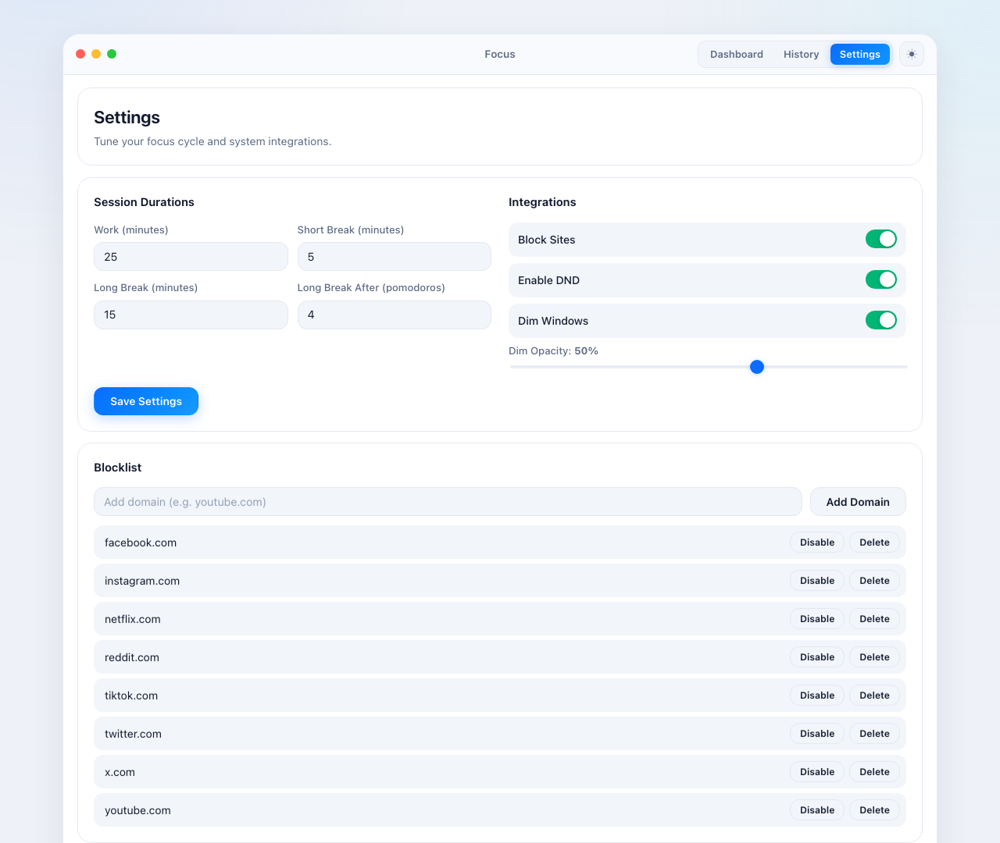

# Focus Mode Controller

A local macOS Pomodoro dashboard built with Flask and vanilla JS.
It runs timed focus sessions and can automatically block distracting sites, toggle Do Not Disturb, and dim windows while you work — all from a minimalist, animated, bento-style dashboard with light and dark themes.



## Features

- **Bento dashboard** — at-a-glance stat cards (today's focus, sessions, day streak, sites blocked), live world-style clock with greeting, daily-goal progress ring, weekly trend chart, utility status, and blocklist
- **Animated Pomodoro timer** — gradient progress ring with tick marks, glow while focusing, session-aware colors (blue for focus, green for breaks), live countdown over Server-Sent Events (SSE)
- **Light + dark themes** — toggle in the titlebar, defaults to your system preference, persisted across visits
- Work, short break, and long break session flow with cycle tracking
- Blocklist management for distracting sites (`/etc/hosts` based)
- Session history with stats and a completion chart
- Settings UI for durations and integration toggles
- Demo mode for safe testing (no system changes)

## Screenshots

| Focus session (dark) | Dashboard (light) |
| --- | --- |
|  |  |

| History (dark) | Settings (light) |
| --- | --- |
|  |  |

## Tech Stack

- Backend: Flask, SQLAlchemy, APScheduler
- Frontend: HTML templates + vanilla JavaScript + CSS (no build step)
- Database: SQLite (`~/.focus-mode/focus.db`)
- Platform integrations: macOS Shortcuts, AppleScript, optional Hammerspoon

## Quick Start

### 1) Create environment and install dependencies

```bash
python3 -m venv .venv
source .venv/bin/activate
pip install -r requirements.txt
```

### 2) Run in normal mode (full functionality)

Use `sudo` so the app can edit `/etc/hosts` for site blocking:

```bash
sudo python3 run.py --port 5000
```

Open `http://127.0.0.1:5000`.

### 3) Run in demo mode (safe, no OS changes)

```bash
python3 run.py --demo --port 5000
```

Demo mode:

- Seeds 21 days of sample history
- Uses 10-second sessions
- Skips hosts edits and macOS automation effects

## macOS Setup

### Hosts write access

- Required for real website blocking
- Run normal mode with `sudo`

### Accessibility permission

Grant access at:

- `System Settings` -> `Privacy & Security` -> `Accessibility`
- Enable your terminal (or Python host app)

### Do Not Disturb shortcuts (recommended)

Create two shortcuts with exact names:

- `Enable Do Not Disturb`
- `Disable Do Not Disturb`

Verify:

```bash
shortcuts list
```

## Scripts

### API smoke checks

```bash
./scripts/api_smoke.sh
./scripts/api_smoke.sh http://127.0.0.1:5050
```

### One-command demo smoke flow

```bash
./scripts/smoke_demo.sh
./scripts/smoke_demo.sh 5051
```

If your Python executable is different:

```bash
PYTHON_BIN=.venv/bin/python3 ./scripts/smoke_demo.sh
```

## Logging and Data

- Logs: `~/.focus-mode/focus.log`
- DB: `~/.focus-mode/focus.db`
- Integrations fail safely: blocking, DND, and dimming errors are isolated and do not crash the app

## Optional Menubar Mode

Run:

```bash
python3 menubar.py
```

Menu options:

- Open App
- Quit

## Project Layout

```text
focus-mode-controller/
├── app/
├── static/
├── templates/
├── scripts/
├── docs/screenshots/
├── config.py
├── run.py
├── menubar.py
└── README.md
```
## Open to use, and contributions are welcome:)
